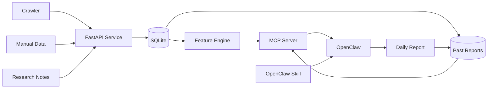

# Futures AI KB

> 一个面向 OpenClaw 的期货数据与往期报告 MCP 服务。
> 将烧碱、PVC、焦煤行情、手工数据、资讯和报告保存在模型上下文之外，由 AI 按需调用。

当前版本：`v0.2.3` MVP
适用品种：烧碱 `SH`、PVC `V`、焦煤 `JM`

[English Summary](#english-summary)

## 为什么需要它

让 OpenClaw 每天生成期货报告时，如果直接读取完整数据库、爬虫结果和往期报告，会导致：

- 上下文持续膨胀。
- token 成本随天数增长。
- 旧数据污染当天分析。
- 模型自行计算指标，容易出现口径错误。

Futures AI KB 把这些数据放在独立服务中，只向 OpenClaw 返回当前任务所需的最小数据包。

## 核心特性

- SQLite 行情、手工指标、资讯、爬虫运行记录和往期报告存储。
- FuturesIntelTool SQLite 和日报目录只读兼容。
- 烧碱、PVC、焦煤日线特征计算。
- MA5、MA20、1/5 日涨跌、持仓变化、成交量 Z-Score、基差和异常标记。
- MCP stdio 与 Streamable HTTP。
- FastAPI 数据导入和查询接口。
- 受控爬虫执行，只允许本地白名单命令。
- 往期报告持久化，但普通日报不自动读取。
- AI 通过 `report_list` 和 `report_read` 按需查询历史。
- OpenClaw Skill 和 Automation 接入示例。
- 单元测试、API 测试和真实 MCP stdio 集成测试。

## 架构



设计原则：

- 原始行情、爬虫结果、新闻全文不进入模型上下文。
- 所有指标由确定性代码计算。
- MCP 返回短字段、短摘要和引用。
- 每份日报使用独立会话。
- 往期报告只在模型明确调用时加载。
- 报告保存后，不自动拼接到下一次日报。

## MCP 工具

| 工具 | 作用 | 默认是否进入上下文 |
|---|---|---|
| `daily_report_context` | 返回当天精简日报数据包 | 是，报告任务调用后 |
| `manual_data_submit` | 提交现货、库存、开工率等结构化数据 | 只返回接收数量 |
| `market_run_crawler` | 运行本地白名单爬虫 | 只返回运行状态 |
| `research_search` | 检索新闻、公告和研报摘要 | 最多三条短摘要 |
| `report_save` | 保存完整往期报告 | 不返回正文 |
| `report_list` | 返回往期报告目录和摘要 | 只在 AI 调用时 |
| `report_read` | 按 token 预算读取指定报告 | 只在 AI 调用时 |

## 快速开始

### 环境要求

- Python 3.12+
- [uv](https://docs.astral.sh/uv/)
- OpenClaw，可选；只使用 HTTP API 时不需要

### 安装和测试

```powershell
git clone <your-repository-url>
cd futures-ai-kb

uv sync --extra dev
uv run pytest
```

### 生成本地演示数据

```powershell
uv run futures-kb-seed --date 2026-09-19 --days 60
```

### 启动 HTTP API

```powershell
uv run futures-kb-api
```

默认地址：`http://127.0.0.1:8787`

### 启动 MCP Server

stdio：

```powershell
uv run futures-kb-mcp
```

Streamable HTTP：

```powershell
uv run futures-kb-mcp --transport streamable-http --host 127.0.0.1 --port 8790
```

## 接入 OpenClaw

先复制爬虫配置模板：

```powershell
Copy-Item config\crawlers.example.json config\crawlers.local.json
```

注册 stdio MCP：

```powershell
$repo = (Resolve-Path .).Path
$python = Join-Path $repo ".venv\Scripts\python.exe"

openclaw mcp add futures-kb `
  --command $python `
  --arg '-m' `
  --arg 'futures_kb.mcp_server' `
  --cwd $repo `
  --include 'daily_report_context,manual_data_submit,market_run_crawler,research_search,report_save,report_list,report_read'

openclaw mcp doctor futures-kb --probe
```

安装 Skill：

```text
skills/futures-daily-report/SKILL.md
```

将整个 `skills/futures-daily-report` 目录放到 OpenClaw 的 workspace skill 根目录。

完整说明见 [OpenClaw 接入文档](docs/05-mcp-and-openclaw.md)。

## 日报和往期报告流程

```text
1. OpenClaw 调用 daily_report_context
2. OpenClaw 生成日报
3. OpenClaw 调用 report_save
4. 完整报告写入 SQLite
5. 日报会话结束并归档

用户以后询问历史：
6. OpenClaw 调用 report_list
7. 选择 report_id
8. OpenClaw 调用 report_read
9. 根据 next_offset 决定是否需要继续读取
```

`daily_report_context` 不返回往期报告正文。
只有 `report_read` 会按需返回指定报告，默认单次最多 2,000 token。

## HTTP API

### 行情

```http
POST /api/v1/market/bars
```

### 手工数据

```http
POST /api/v1/manual-data
```

### 资讯

```http
POST /api/v1/research
```

### 爬虫

```http
POST /api/v1/crawlers/{source}/run?trade_date=2026-09-19
```

### 日报数据包

```http
GET /api/v1/report-context?trade_date=2026-09-19&symbols=SH,V,JM
```

### 往期报告

```http
POST /api/v1/reports
GET  /api/v1/reports
GET  /api/v1/reports/{report_id}
```

接口细节见 [API 与爬虫](docs/04-api-and-crawler.md) 和 [往期报告存储](docs/06-report-storage.md)。

## 配置

| 环境变量 | 默认值 | 说明 |
|---|---|---|
| `FUTURES_KB_DB` | `data/futures_kb.sqlite3` | SQLite 数据库路径 |
| `FUTURES_KB_CRAWLER_CONFIG` | `config/crawlers.local.json` | 爬虫白名单配置 |
| `FUTURES_KB_RAW_DIR` | `data/raw` | 爬虫原始输出目录 |
| `FUTURES_KB_API_KEY` | 空 | 设置后 HTTP 写接口和报告接口要求 `X-API-Key` |
| `FUTURES_KB_API_HOST` | `127.0.0.1` | API 监听地址 |
| `FUTURES_KB_API_PORT` | `8787` | API 监听端口 |

## 安全说明

- 默认仅监听 `127.0.0.1`。
- 不要把无认证 API 暴露到公网。
- 爬虫命令来自本地受信任配置，OpenClaw 不能提交任意命令。
- 不建议让模型直接执行数据库 SQL 或任意文件路径。
- 不要把真实 Cookie、API Key 和交易账户凭据提交到 Git。
- 本项目的分析输出不构成投资建议。

更多信息见 [SECURITY.md](SECURITY.md)。

## 测试

```powershell
uv run pytest
```

当前测试覆盖：

- 行情和手工数据幂等写入。
- 指标和日报数据包。
- FastAPI 接口。
- 爬虫白名单和标准输出导入。
- MCP 工具发现和调用。
- 真实 MCP stdio 子进程连接。
- 往期报告保存、列表、按需读取和 token 截断。
- 日报上下文不自动包含往期报告。

## 项目结构

```text
src/futures_kb/       核心服务、存储、指标、API、MCP
skills/               OpenClaw Skill
config/               爬虫配置模板
docs/                 架构、流程和接入文档
examples/             本地假爬虫
tests/                单元、API、MCP 和 stdio 集成测试
```

## 文档

- [架构说明](docs/01-architecture.md)
- [程序流程](docs/02-program-flow.md)
- [存储与特征](docs/03-storage-and-features.md)
- [API 与爬虫](docs/04-api-and-crawler.md)
- [MCP 与 OpenClaw 接入](docs/05-mcp-and-openclaw.md)
- [往期报告存储](docs/06-report-storage.md)
- [GitHub 发布流程](docs/07-github-release.md)
- [FuturesIntelTool 兼容](docs/08-futures-intel-compatibility.md)
- [Skill 流程](docs/09-skill-pipeline.md)
- [合约管理与可视化控制台](docs/10-contract-management-ui.md)

## Roadmap

- [ ] PostgreSQL/TimescaleDB 存储后端。
- [ ] 新闻和研报混合检索。
- [ ] Reranker 和引用评估。
- [ ] 更完整的合约换月和连续合约处理。
- [ ] Docker Compose。
- [ ] Web 管理界面。
- [ ] 数据源插件接口。
- [ ] 报告质量评测集。

## 免责声明

本项目用于数据工程、报告自动化和研究辅助，不构成投资建议。期货市场风险较高，任何交易决策都应由使用者独立判断并自行承担风险。

## License

[MIT](LICENSE)

## English Summary

Futures AI KB is an external market-data and report-retrieval service for OpenClaw. It keeps raw futures data, crawler output, research articles, and historical reports outside the model context. OpenClaw receives a compact computed daily packet and reads selected past reports only through explicit MCP calls.

Supported symbols:

- `SH`: Caustic soda futures
- `V`: PVC futures
- `JM`: Coking coal futures

Core stack: Python, FastAPI, SQLite, MCP 2.x, OpenClaw Skill.
